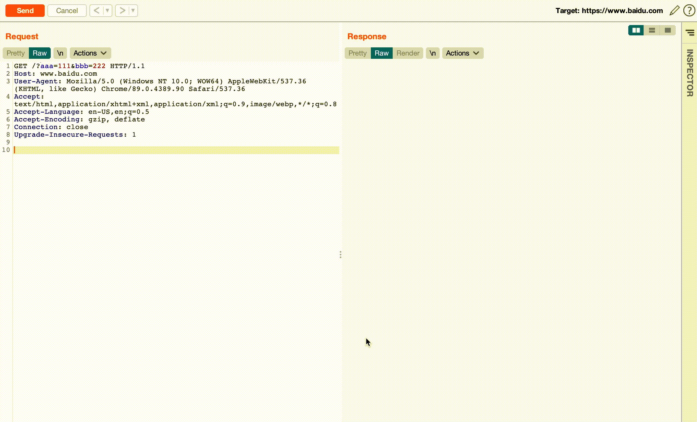

# Upload File Request
一款用于生成上传文件请求的Burp插件，用法：`右击 -> Upload simple file`

懒👨必备

# 参考
https://github.com/PortSwigger/content-type-converter/tree/master/ContentTypeConverter/
https://blog.csdn.net/xiaojianpitt/article/details/6856536
https://www.cnblogs.com/vipygd/p/11279537.html
https://blog.csdn.net/zhangmiaoping23/article/details/79786187